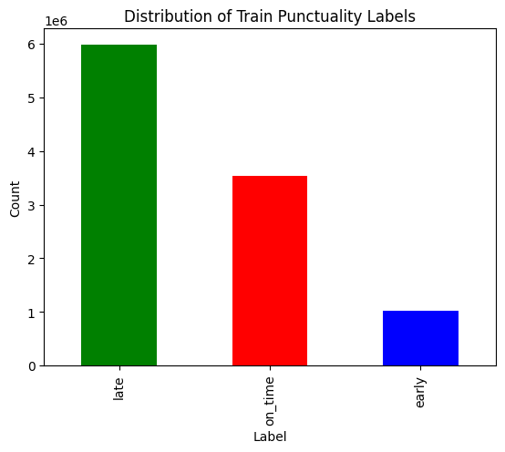
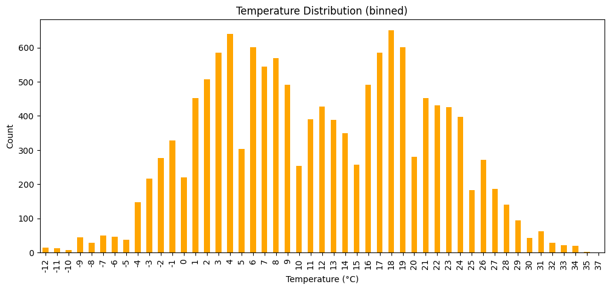
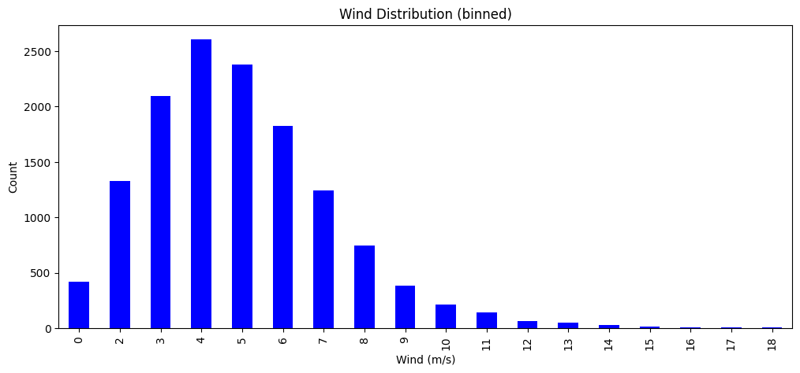
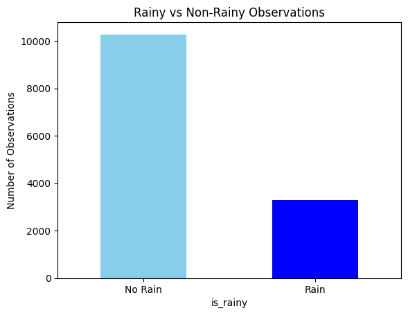
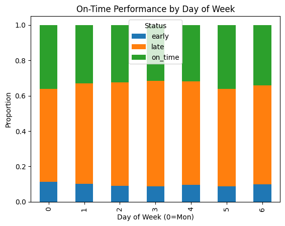
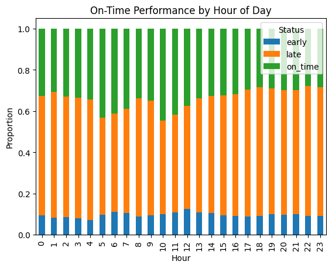
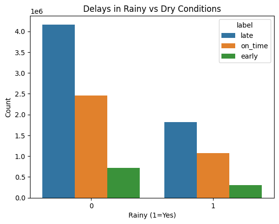
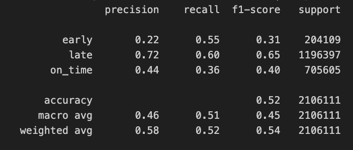

# Midterm Report
Video Link: https://www.youtube.com/watch?v=z7LYP2XCOFs

## Data Processing/Modelling
- Downloading Required Data
  - MBTA 2024 - 2025 Zip Files
    - mbta_2024_url = "https://www.arcgis.com/sharing/rest/content/items/96c77138c3144906bce93d0257531b6a/data"
    - mbta_2025_url = "https://www.arcgis.com/sharing/rest/content/items/924df13d845f4907bb6a6c3ed380d57a/data"
  - Weather Data
    - 2024 - https://www.ncei.noaa.gov/data/global-hourly/access/2024/72509014739.csv
    - 2025 - https://www.ncei.noaa.gov/data/global-hourly/access/2025/72509014739.csv  - 2025-01-01 to 2025-08-27
- Data Cleaning
  - Removal of None values
  - Removal of incorrect measurements
- Feature selection and calculations
  - Features directly from dataset: "route_encoded","TMP", "wind_speed_mps", "wind_dir_deg"
  - Features calculated:
    - "day_of_week": 0-6 value assigned to Monday-Sunday
    - "is_weekend": assigned 0 or 1 value whether the day is weekday/weekend
    - "is_holiday": assigned 0 or 1 using holidays library
    - "is_rainy": Using the AA1, AA2, AA3 values from database which are precipitation amounts, calculated the raindrop for the hour
  - Labels:
    - Early: Bus arrived 2 minutes earlier than the scheduled time
    - On Time: Bus arrived within +/- 2 minutes range of scheduled time
    - Late: Bus arrived more than 2 minutes late
## Data Visualization
  - 
  - 
  - 
  - 
  - 
  - 
  - 
## Preliminary Results
Used a random forest classifier with the following hyperparameters:
  - 80%-20% training/test split for 10M rows
  - n_estimators=50,
    max_depth=20,
    class_weight="balanced"
  - 

## Next Steps
 - Increase accuracy
 - Try different classification models
 - Include 2025 datasets
# Public Transportation Delay Classification (Proposal)
## Description
As a daily user of public transportation, with this project, I would like to classify the arrival of local buses as late, early and on time depending on the  weather, time, and the day of the week for each stop. To do the classification, I will test different model types that are used in classification tasks like random forest classifier.

## Goals
- Classify the bus delay time as late/early/on time according to the current weather, day of the week and time for each stop
- Detect anomalies in delay time under current conditions
- Simple local web app to test the model (if time remains)

## Data Collection
To do the classification and anomaly detection, I will need to collect weather data (temperature, wind, weather condition) and bus arrival information (the arrival time and scheduled time, the information about the stop). For bus, my current plan is to use MBTA's public data for 2024 and 2025 (until today) (https://mbta-massdot.opendata.arcgis.com/). For weather information, I am planning to use National Centers for Environmental Informations's API to pull past weather data (https://www.ncdc.noaa.gov/cdo-web/webservices/v2). According to my research, they are free to use with request rate limit constraints. My plan for the data collection is as the following:
- Retrieve bus data and weather data from two sources
- Match the data using the date and time of the data
- Do data cleaning for off hours
- Current plan for the data features are: [bus stop id, delay time (actual - scheduled arrival), temp, wind, weather condition, current time, day_of_the_week, is_holiday, weekday/weekend, late/early/ontime]

## Modeling the Data
I will do more research on this in the upcoming next weeks for the best model selection. I am planning to use a classification model like random forest classifier to do the classification. For anomaly detection, I am planning to test isolation forest's performance. My current knowledge in models is limited to ML introduction class. I will learn more about which model is a better fit for my goals until I start the training.

## Visualizing Data
I am planning to use scatter plots to visualize the data collected. Example plots can be temperature vs delay, and current time vs delay. Correlation matrices to understand the relation between features. After making the classification, I will do predicted classification and actual classification scatter plot to see the difference. Lastly, by implementing a web app, I am planning to have a test environment where the user can pick the variables and see the model's performance/results.

## Test Plan
I am planning to split the 2024 data into 70-10-20 for training/validation/test for the midterm and see the performance. During the time between midterm and final, I will combine 2024 and 2025 data to have a larger dataset and retrain the model using the whole 2024 data and use 2025 as testing data.
